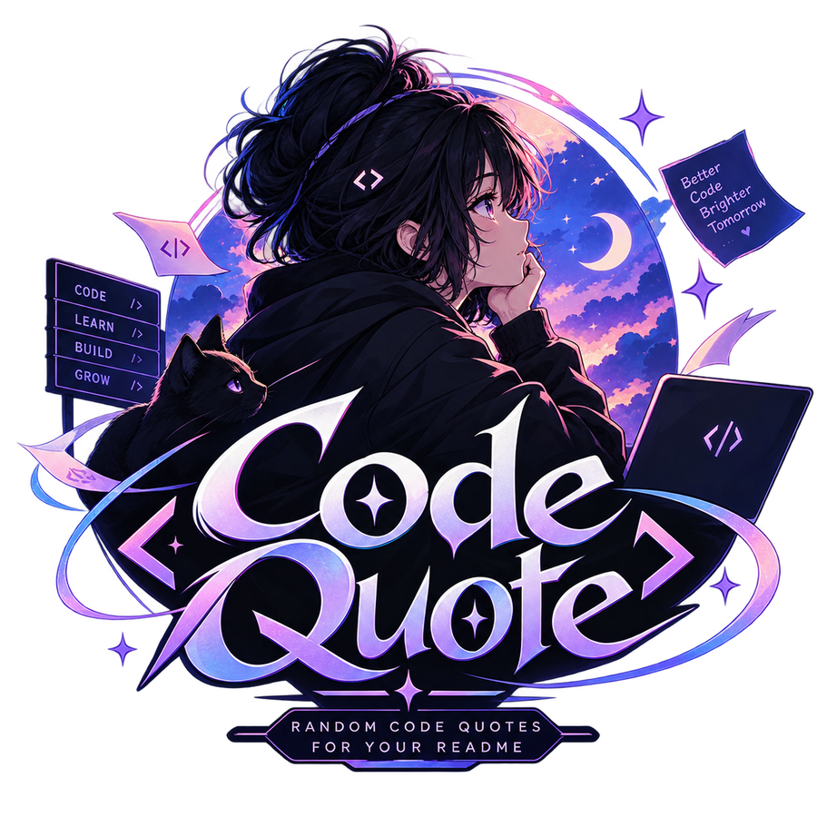

<div align="center">



# CodeQuote

### Beautiful coding quotes for your GitHub README

CodeQuote renders a random programming quote as a **self-contained SVG card** on every request.
Drop one image tag into your README and it just works — no JavaScript, no database, no account.

[](https://github.com/Itz-Anya/Code-Quote)


</div>

## 🌐 Live Website 

<div align="center">

[](https://codequote.vercel.app/)

</div>

## ✨ Features

| | |
|---|---|
| 🔀 **Random on every request** | A fresh quote is selected from a curated set each time the endpoint is hit. |
| 🧩 **Self-contained SVG** | No external images or fonts, so the card renders identically anywhere it's embedded. |
| 📄 **README-ready** | Built specifically to sit inside a Markdown image tag on GitHub, GitLab, or npm. |
| 🎨 **Themeable** | Switch between dark, light, or an auto-adapting GitHub-aware theme via a query parameter. |
| 🛡️ **No account, no database** | Nothing to sign up for and nothing about you gets stored. |
| 🐙 **Open source** | MIT licensed. Read the code, self-host it, or send a pull request. |

---

## 🚀 Usage

Paste the snippet below anywhere in your `README.md`. GitHub re-fetches the image on every view, so the quote changes over time.

```md

```

That's it — no setup, no API key, no build step.

---

## 🔌 API

A single, predictable endpoint. No API key, no rate-limit headers to manage, no request body — one `GET` request returns one SVG.

**Endpoint**

```
GET /api/quote.svg
```

**Example request**

```bash
curl -i "https://codequote.vercel.app/api/quote.svg?theme=github"
```

**Response headers**

```
Content-Type: image/svg+xml
Cache-Control: no-cache
```

**Query parameters**

| Parameter | Values | Default |
|---|---|---|
| `theme` | `dark`, `light`, `github`, `dracula`, `nord`, `monokai`, `solarized`, `gruvbox`, `onedark`, `tokyonight`, `catppuccin`, `synthwave`, `ayu`, `rosepine` | `dark` |
| `author` | substring match, e.g. `Torvalds` | any |
| `font` | `sans`, `serif`, `mono` | `sans` |
| `width` | `380`–`900` (px) | `600` |

---

## 🛠️ Built in the open

CodeQuote is a small, MIT-licensed project. Browse the source, open an issue, or contribute a new quote.

[](https://github.com/Itz-Anya/Code-Quote)
[](https://github.com/Itz-Anya/Code-Quote/issues)

---

## 👩‍💻 Creators

<table width="100%">
    <tr>
      <td align="center" width="50%">
        <br><br>
        <b>𝜜ɴყꫝㅤ𓆩💗𓆪</b><br><br>
        <a href="https://github.com/itz-Anya">
          
        </a>
      </td>
      <td align="center" width="50%">
        <br><br>
        <b>𝐌 𝐔 𝐑 𝚨 𝐋 𝐈 𓂃ִֶָ⋆.˚</b><br><br>
        <a href="https://github.com/Itz-Murali">
          
        </a>
      </td>
    </tr>
  </table>

---

## 📄 License

Released under the **MIT License**. See [`LICENSE`](https://github.com/Itz-Anya/Code-Quote/blob/main/LICENSE) for details.

<div align="center">

Made with 💗 by the CodeQuote contributors

</div>
